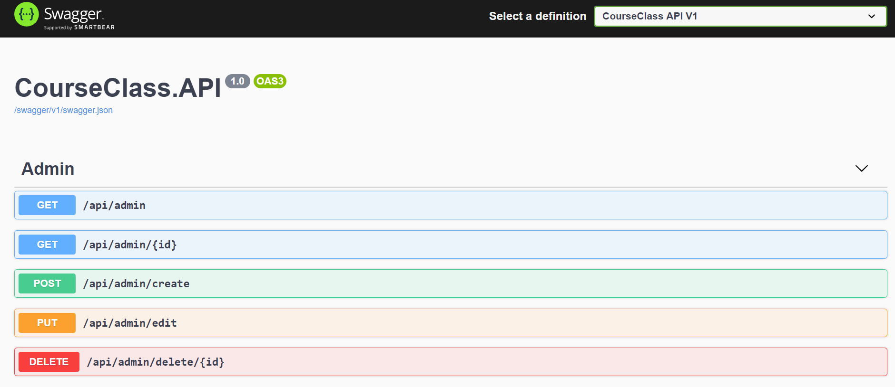
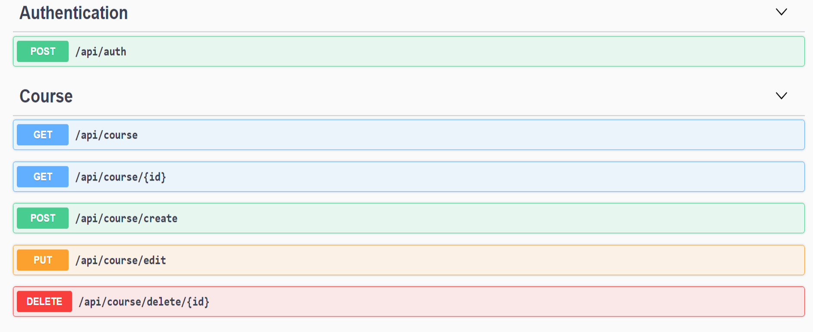
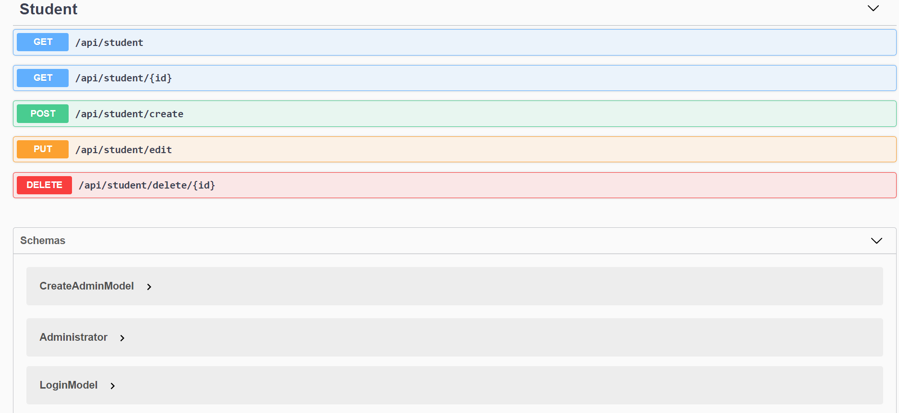

# CourseClass-Server

##### [Go To Course Class Client](https://github.com/JonathanDarmon/CourseClass-Client "Client Side")
___

# Using:
  * DotNet Core 3.1
  * SqlServer (EntityFrameworkCore)
  * Three-tier Architecture
  
## Screenshots

